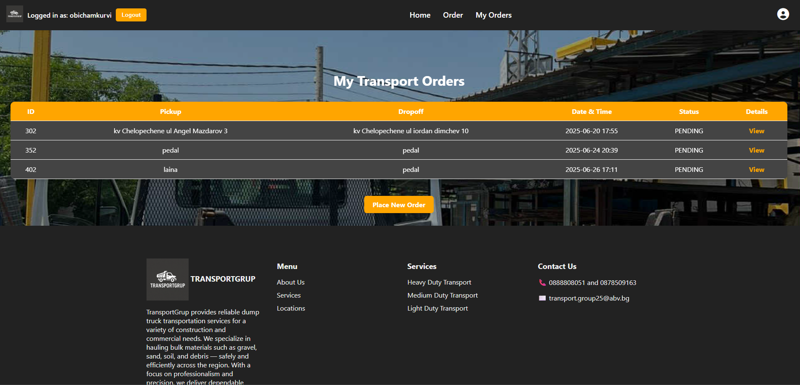

# 🚚 TransportGrup – Truck Transport Web App

**TransportGrup** is a full-featured Spring Boot web application for managing transport orders and services. Users can register, log in, place service requests, and track their orders with ease.

---

## 🌟 Website Preview

### 🏠 Homepage – Hero Section


### 📋 User Dashboard – Transport Orders



---

## 🔧 Features

- ✅ User registration, login, and email verification
- ✅ JWT-based authentication
- ✅ Edit profile and change username
- ✅ Place and manage transport orders
- ✅ Track order status (Pending/Active)
- ✅ Responsive design with modern UI
- ✅ Admin-friendly database structure

---

## 🛠 Tech Stack

| Backend         | Frontend        | Database      | Security      |
|----------------|-----------------|---------------|---------------|
| Spring Boot     | HTML, CSS       | MySQL         | Spring Security |
| Spring Web MVC  | Thymeleaf       | JDBC/Raw SQL  | JWT, BCrypt    |

---

## 🧾 Sample Services Offered

- **Heavy Duty Transport** – Large volume deliveries across the region
- **Medium Duty Transport** – Ideal for mid-size loads
- **Light Duty Transport** – For local runs and small-scale hauling

---

## 📞 Contact

For any queries or transport scheduling, reach out to us:

- 📞 **0888808051** or **0878509163**
- 📧 [transport.group25@abv.bg](mailto:transport.group25@abv.bg)

---

## 🗺️ About

> TransportGrup provides reliable dump truck transportation services for a variety of construction and commercial needs. We specialize in hauling bulk materials such as gravel, sand, soil, and debris — safely and efficiently across the region. With a focus on professionalism and precision, we deliver dependable results.

---

## 🚀 Run Locally

```bash
git clone https://github.com/your-username/transportgrup.git
cd transportgrup
./mvnw spring-boot:run
